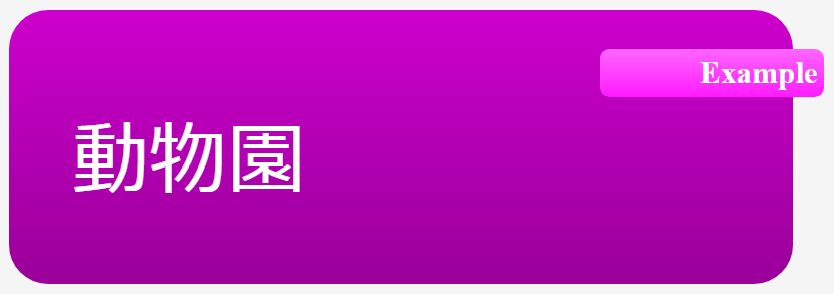
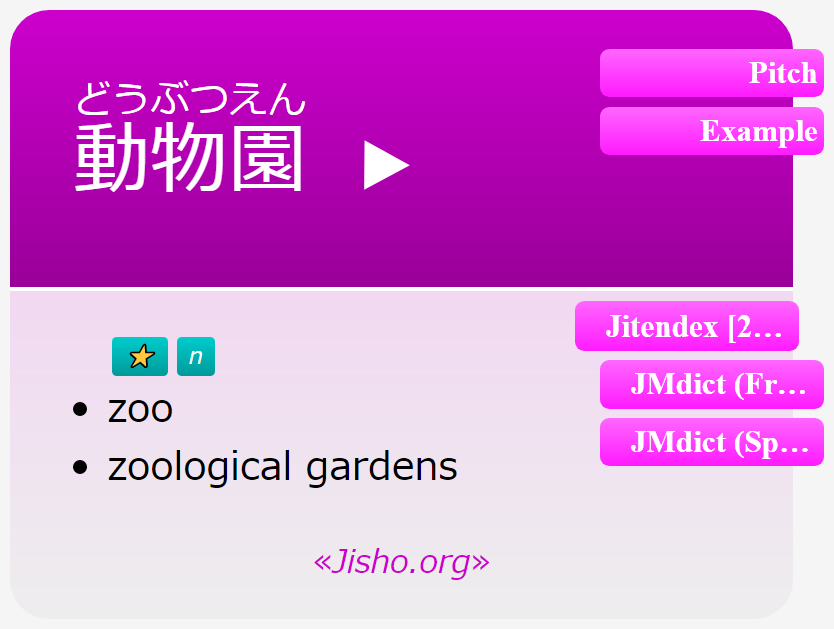
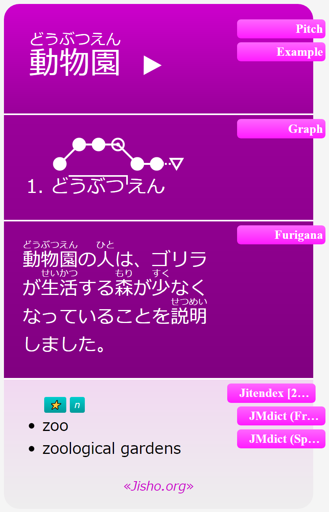
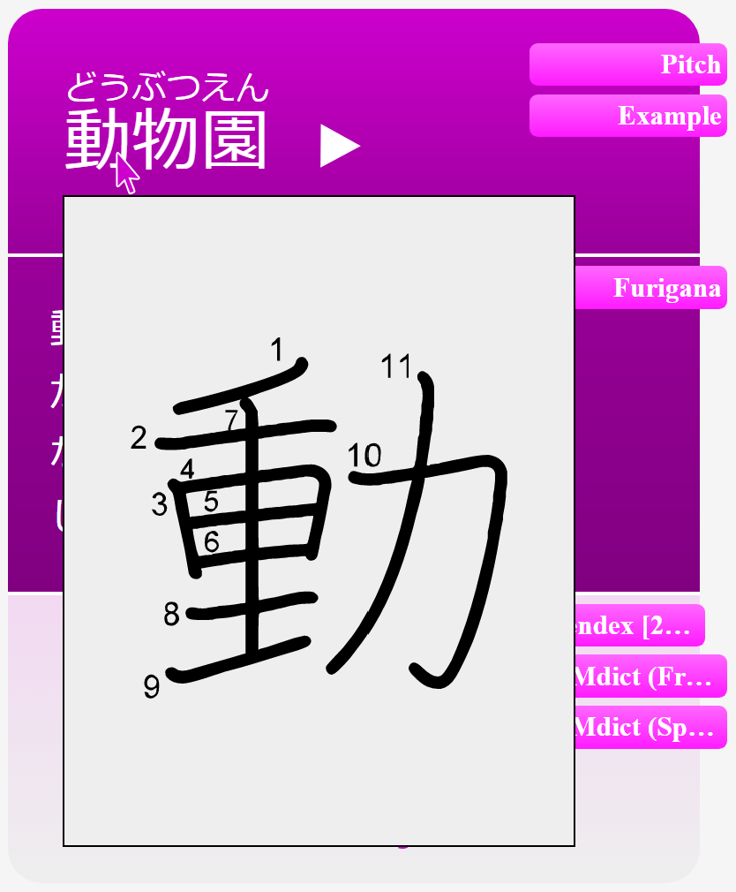

# PrettyYomitanCards

## About this Project

This repository aims to provide a practical template designed to enhance your Anki flashcards and seemlessly integrate with the Yomitan browser extension through the use of HTML, CSS and JavaScript.

Popup-dictionaries like Yomitan can offer a plethora of information for individual words and expressions.
However, incorporating it all at once into a flashcard for study purposes can quickly lead to being overwhelmed by content.
By only selectively displaying the information, this template aims for a easily digestible format while also ensuring that all potentially useful information remains accessible.

## Card Design
<picture>
  <source media="(prefers-color-scheme: dark)" srcset="images/AnkiDemo/demoFrontDark.png">
  <source media="(prefers-color-scheme: light)" srcset="images/AnkiDemo/demoFront.png">
  
</picture>

### Front Template
The front is designed to be as simple as possible by default, showing only the expression in question.
By providing as little additional information as possible the card can be stripped of unconcious cues that might help discerning the answer without genuine recollection.
But for those who prefer learning their words in context, pressing the `Example` button reveals the sentence from which the card was generated.
The cards also offer the option to set the sentence to always be visible, if so desired.

 

<picture>
  <source media="(prefers-color-scheme: dark)" srcset="images/AnkiDemo/demoBackDark.png">
  <source media="(prefers-color-scheme: light)" srcset="images/AnkiDemo/demoBack.png">
  
</picture>

### Back Template
On the back side of a card, the expression is presented with furigana as a pronounciation guide, accompanied by the glossaries from Yomitan.
This setup allows for a quick verification of the reading and meaning at a glance when reviewing the cards.
The different glossary entries are organized initially by their assigned tags in the dictionary and then separated into individual subgroups based on their core meanings, mirroring the original dictionary's structure.

Additionally, if Yomitan was able to source an audiofile of the pronounciation, a play button next to the expressions allows one to listen to it.
A direct link to the term's search results in the [jisho.org](https://jisho.org) online dictionary is also available at the bottom of the card, offering more information about the its usage and the associated kanji.

 

<picture>
  <source media="(prefers-color-scheme: dark)" srcset="images/AnkiDemo/demoBackFullDark.png">
  <source media="(prefers-color-scheme: light)" srcset="images/AnkiDemo/demoBackFull.png">
  
</picture>

Further functionality is accessible through buttons on the card itself, allowing to trigger the display of various types of information.
For example, if multiple dictionaries are installed, ona can switch between their respective entries via tabs on the side.
An installed pitch accent dictionary is installed, it is possible to show a visualisation of an expression's pitch pattern, or patterns if multiple are in use, either through markers on the term's reading or an optional graph above it, if preferred.
Like on the front side, one can also enable the example sentence, if given.
This time with the addition of a furigana option as well.
The `Notes` field of a card provides space for additional information and, if used, another tab appears below the ones for `Pitch` and `Example`, which can be used to trigger the display of the custom notes.

In order to get more information on the different tags, that have been assigned to a card, one can hover their cursor over one (or tab it on mobile devices), revealing a popup with a short description. Note that this is based on the usage of tags in an individual dictionary, and will not be available if the dictionary does not provide the necessary tag data.
In a similar vein, hovering over, or tapping, a kanji in the expression will show a popup with its handwritten form, with the individual strokes labeled in the traditional drawing order.

 

## How to set up

### Requirements
First, you need to install the necessary programs for the generation of Anki cards:
- [Anki](https://apps.ankiweb.net) flashcard program - version 2.1.50 or higher
- [Yomitan](https://github.com/themoeway/yomitan) browser extension  
  *please note that while these cards should be compatible with it, [Yomichan](https://foosoft.net/posts/sunsetting-the-yomichan-project/) has been discontinued and it is highly recommended for current users to switch to Yomitan instead.
  Instructions for migrating your settings and dictionaries can be found [here](https://github.com/themoeway/yomitan/blob/master/docs/yomichan-migration.md#migrating-from-yomichan).*
- [AnkiConnect](https://ankiweb.net/shared/info/2055492159) AddOn for Anki

- A dictionary for Yomitan  
  Due to big differences in their formating, only some dictionaries may be compatible with this card design. 
  The tested ones include:
   - [Jitendex](https://github.com/stephenmk/Jitendex) - modern format for the J->E JMdict
   - [JMdict](https://github.com/themoeway/jmdict-yomitan#jmdict-for-yomitan-1) - dictionary availabe in various languages
   - [JMnedict](https://github.com/themoeway/jmdict-yomitan#jmnedict-for-yomitan) - readings for different kinds of names and proper nouns
   - [Kanjium](https://github.com/mifunetoshiro/kanjium) - pitch accents *- see [here](https://foosoft.net/projects/yomichan/index.html#dictionaries) for a direct download link*

To add a dictionary to Yomitan, in the Yomitan settings under `Dictionaries` click the `Configure installed and enabled dictionaries…` option, then `Import` and select the *.zip* file of the dictionary.

### Creating the Anki Note Type

> You can skip this section by simply importing the [demo Deck](https://github.com/99-Knots/PrettyYomitanCards/releases/tag/v1.0.0) and using the note type that comes with it.
> Continue the setup with the [Configuring Yomitan](#configuring-yomitan) section.

In the Anki desktop app, under `Tools > Manage Note Types` click `Add`. You will be prompted to select an existing type as a base. Your choice here doesn't matter as we will be doing quite some customization anyway, so picking `Add:Basic` is fine. Give your new note type a name and click `OK`.

With your new note type selected click on `Fields` and add and delete fields till your card type looks like this:

<picture>
  <source media="(prefers-color-scheme: dark)" srcset="../main/images/AnkiFieldsDark.png">
  <source media="(prefers-color-scheme: light)" srcset="../main/images/AnkiFields.png">
  
</picture>

Pay extra attention to the spelling and capitalization of each field name.
You can ignore the other settings on this page, as they will only affect the appearance of the fields in the card browser.

Save your changes and return to the note types editor, this time selecting `Cards` instead of `Fields`.
Delete all the existing code in the *Front Template* and replace it with the following:

 
 <b>Front Template Code</b> 

 <!--insert-start: frontTemplate.html-->
https://github.com/99-Knots/PrettyYomitanCards/blob/5ed1266a0b51027bb60e621b31ccf88b4f5506ce/frontTemplate.html#L1-L157
<!--insert-end-->

 

Do the same with the *Back Template*:

 
 <b>Back Template Code</b> 

 <!--insert-start: backTemplate.html-->
https://github.com/99-Knots/PrettyYomitanCards/blob/5ed1266a0b51027bb60e621b31ccf88b4f5506ce/backTemplate.html#L1-L478
<!--insert-end-->

 

and for *Styling*:

 
 <b>Style Sheet</b> 

 <!--insert-start: style.css-->
https://github.com/99-Knots/PrettyYomitanCards/blob/5ed1266a0b51027bb60e621b31ccf88b4f5506ce/style.css#L1-L311
<!--insert-end-->

<picture>
  <source media="(prefers-color-scheme: dark)" srcset="images/AnkiDemo/demoBackStrokesDark.png">
  <source media="(prefers-color-scheme: light)" srcset="images/AnkiDemo/demoBackStrokes.png">
  
</picture>

#### Stroke Order Popup

To have the popup when hovering over a kanji display their stroke order, it is necessary to install this [Japanese Stroke Order Font](https://www.nihilist.org.uk). 
Instructions for doing so can be found in the [Anki Manual](https://docs.ankiweb.net/templates/styling.html#installing-fonts).

This step is optional, if one does not intend to use this information.
Without the font installed the popup will simply show a bigger version of the kanji in the same font.
 

### Configuring Yomitan

Open Yomitan's settings page in your browser and navigate to the `Anki` section. 
Make sure your connection with AnkiConnect is enabled and working properly before clicking on `Configure Anki card format...`.

At the top right choose a deck you want your generated cards to be added to and below that on the `Model` field select the new node type you created (or *PrettyYomitan* if you are using the demo deck).
Yomitan will then show you a list of the selected node type's fields. 
Set their values according to the following image:

<picture>
  <source media="(prefers-color-scheme: dark)" srcset="../main/images/YomitanFieldsDark.png">
  <source media="(prefers-color-scheme: light)" srcset="../main/images/YomitanFields.png">
  
</picture>

Yomitan will probably fill out most of this automatically but make sure to verify the correct values.
Also note that the *{py-glossary}* entry for the `Meaning` field does not appear in the expandable list. This is normal, you will have to enter it by hand.

Close the popup window when you are done and enable the `Advanced` mode switch at the bottom left of the settings page for the next step.
Without doing so the `Configure Anki card templates...` option will not appear. 
Click it and without changing anything insert the following at the bottom of the code window (below the line *{{~> (lookup . "marker") ~}}*):

 
 <b>Yomitan Template Code</b> 

 https://github.com/99-Knots/PrettyYomitanCards/blob/1dc3dbb85bc81a12d4eabae4c83ce1982da5c558/yomitanTemplate.hbs#L1-L87

You can verify this step by typing *{py-glossary}* into the Card Field and pressing `Test`. If it says *"The partial py-glossary could not be found"*, check your spelling, reset the template with the button at the bottom and try again.

 
You should now be all set up to generate your flashcards from words you find around the web and have them show up in Anki with some nice design and added functionality.
Try clicking the green plus at the top right of the demo in the Yomitan settings to create your first card.
  
※ To enable Yomitan for local files as well, go to your browser's extension settings page (chrome://extensions when using Chrome for example), find Yomitan there and enable 'allow access to file URLs' for it.

## Further customization

You can easily change the cards' font sizing, which fields should be expanded by default and even the color yourself if you want to.

In Anki open the card editor and search for *var colorRGB*, it should be located at the beginning of the template files.
Within the brackets you can enter the R, G and B values for a new main color of your choosing. 
All other colors in the template and a darker night mode version will be calculated based on those values.
Try for example the combination 120, 150, 100 for a nice sage green.

Below the color you will find variables with a *show_XXX_by_default* naming pattern. Changing those from *false* to *true* will automatically expand the respective field when the card appears in your reviews. 
Slightly further down you will also find variables for the font sizes used on the card. Only enter numbers there, the unit (px) will later be added in the code.

For a consistent appearance those changes will have to be applied both to the front and the back template.

## Other Resources
[Anki-Addon](https://ankiweb.net/shared/info/580654285) for more audio options for Yomichan

Japanese Font selection taken from [here](https://gist.github.com/prantlf/fbd12acc69a022edd589dea48dafe3f8)
